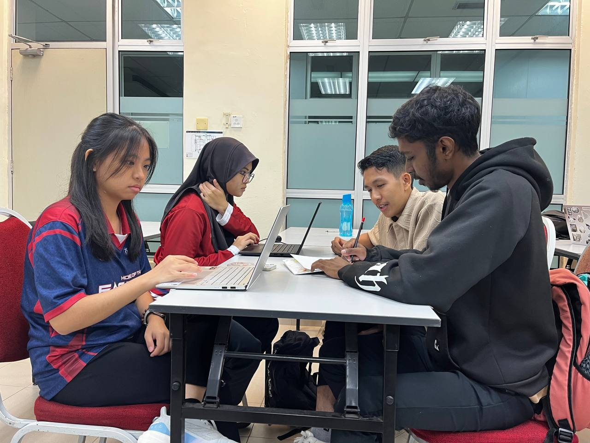

# Design Thinking Project: ADHD Learning Application for Children

**Course:** Technology and Information Systems (SECP1513)  
**Task:** Design Thinking Project
**Lecturer:** Dr. Azurah  
**Team:** 
1) Lily Amira Batrisya
2) Chen Xin Yan
3) Muhammad Adib
4) Sivaraam Murukan  

---

## **Project Overview**

This project applied the **Design Thinking methodology** to develop an interactive learning application for children aged 5-9 with **Attention Deficit Hyperactivity Disorder (ADHD)**. Our goal was to create an engaging digital solution that helps ADHD children improve their focus while learning basic skills like reading, writing, and arithmetic.

### **Project Files & Resources**
[View full report in PDF](DTP-Report.pdf)
  
---

## **The Design Thinking Process**

### **1. Empathize Phase**
We began by deeply understanding our users through:
- **Surveys** via Google Forms to gather insights
- **Interviews** with psychology students and ADHD-aware individuals
- **Research** on ADHD challenges and learning patterns

### **2. Define Phase**
**Problem Statement:**  
Children aged 5–9 years with ADHD often struggle with inattention in classrooms, causing them to lag behind in learning basic skills like reading, writing, and arithmetic.

### **3. Ideate Phase**
Brainstormed solutions included:
- Alphabet tracing mini-games
- Pronunciation practice games
- Basic mathematics games (addition/subtraction)
- Reward systems with points/stars

### **4. Prototype Phase**
Created a functional prototype featuring:
- **Home Page**: User-friendly interface
- **Playground**: Three types of activities with multiple levels
- **Contact Section**: Support access for parents/guardians

### **5. Test Phase**
Conducted usability testing with:
- Observation of user interactions
- Feedback from parents and teachers
- Functionality testing of key features

---

## **Key Features of Our Solution**

### **🎮 Interactive Mini-Games**
1. **Alphabet Tracing**: Improves writing ability and fine motor skills
2. **Pronunciation Practice**: Aids reading and phonics learning
3. **Basic Math Games**: Develops number sense through addition/subtraction

### **⭐ Engagement Features**
- **Reward System**: Points and stars to motivate learning
- **Progress Tracking**: Visual progress indicators
- **Adjustable Difficulty**: Adapts to child's development level

### **👨‍👩‍👧 Parent/Guardian Support**
- **Contact Functionality**: Easy access to support
- **Focus Mode**: Distraction-free learning environment
- **Progress Reports**: Track child's development

---

## **Personal Reflection by Lily Amira Batrisya**

### **🎯 My Goal/Dream Regarding This Program**
I dream of achieving success by creating applications or websites that make daily life easier for others. I aspire to become someone brave enough to stand out while generating new ideas to help the world evolve. Additionally, I hope to be a great leader who can guide teams, share knowledge, and inspire others.

### **💡 How Design Thinking Impacted My Goals**
Throughout this design thinking project, I learned to:
- **Sharpen my communication skills** through team collaboration
- **Expand my imagination** during brainstorming sessions
- **Appreciate diverse perspectives** when solving problems
- **Understand user needs** before developing solutions

This process taught me that effective solutions come from truly understanding the people we're trying to help, not just from technical expertise.

### **🚀 My Action Plan for Industry Improvement**
To enhance my potential in the industry, I will:
1. **Stay updated** with evolving technologies through continuous learning
2. **Master programming languages** like Python, HTML, CSS, Java, and JavaScript
3. **Participate in bootcamps** and workshops to gain practical experience
4. **Build a portfolio** of personal projects on GitHub
5. **Network with professionals** through university and online platforms

### **🎥 Project Snip**
[Watch the snip to our project](/NeuroGame.MOV)

---

## **Team Collaboration**

Our team worked effectively through:
- **Regular meetings** to share insights and coordinate tasks
- **Clear task distribution** based on individual strengths
- **Open communication** channels for feedback and updates
- **Shared documentation** using Google Drive and collaborative tools

*Our team working together on the project*

---

## **Technical Implementation**

### **Tools & Technologies Used**
- **Prototyping**: Canva, Paper sketches
- **Development**: Wix (for prototype website)
- **Documentation**: Google Docs, Microsoft Word
- **Research**: Academic articles, psychology resources
- **Testing**: User observation, feedback collection

### **Prototype Features**
- **Responsive design** for various devices
- **Colorful, child-friendly interface**
- **Simple navigation** for young users
- **Audio-visual elements** to maintain engagement

---

## **Lessons Learned**

1. **User-centered design is crucial** – Understanding ADHD children's needs was the foundation of our solution
2. **Iteration improves outcomes** – Multiple testing rounds led to significant improvements
3. **Interdisciplinary knowledge matters** – Psychology insights enhanced our technical approach
4. **Team diversity strengthens solutions** – Different perspectives created a more comprehensive solution
5. **Documentation is essential** – Clear records helped track progress and justify decisions

---

## **Future Enhancements**

If we continue this project, we would:
1. Develop a **mobile application version**
2. Add **more game categories** (science, logic, creativity)
3. Implement **AI-based adaptive learning**
4. Create **teacher dashboards** for classroom integration
5. Conduct **longitudinal studies** on learning outcomes

---

## **Final Thoughts**

This Design Thinking project was more than just an academic assignment—it was an opportunity to make a real difference in the lives of children with ADHD. It taught me that technology, when combined with empathy and creative thinking, can create meaningful solutions for vulnerable communities.

The most valuable lesson was learning to **listen before building**—to understand the human experience behind every technical problem we solve.

> **"Great design is not just about what it looks like, but about how it makes people feel and what it enables them to do."**

---

*Posted with gratitude,*  
**Lily Amira Batrisya binti Shahrul Sham**  
*Faculty of Computing, Universiti Teknologi Malaysia*  
*You can reach out to me at:*  
*Personal email: lilyamirabatrisya@gmail.com*  
*Student email: lilyamirabatrisya@graduate.utm.my*  

